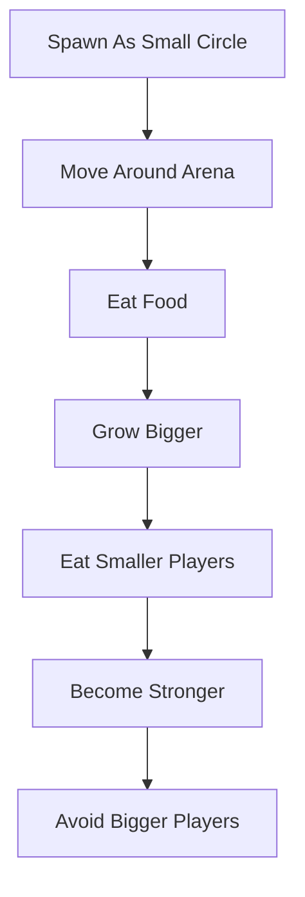
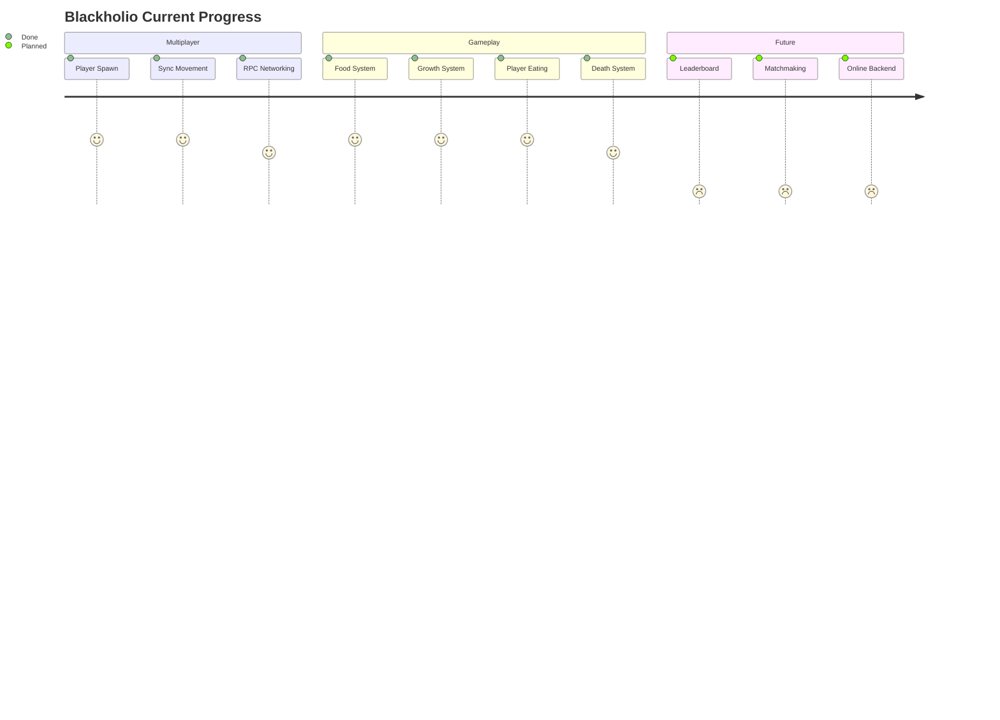
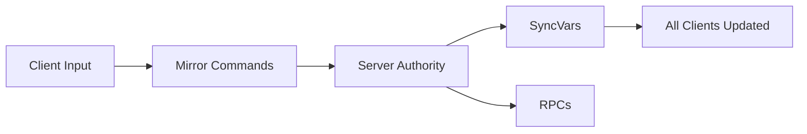
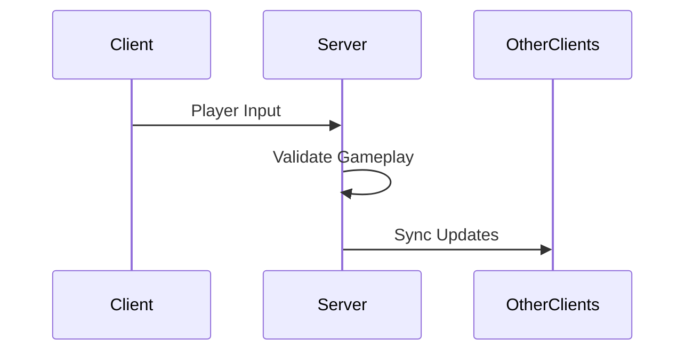
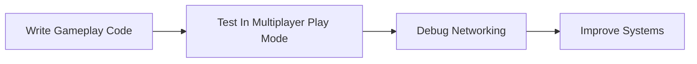
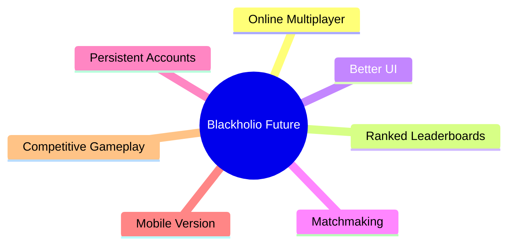

# Blackholio

> Multiplayer agar.io-inspired game built using Unity 6 and Mirror Networking.

Blackholio is a real-time multiplayer 2D survival/growth game where players control circles that grow by consuming food and smaller players while avoiding larger enemies.

This project is being developed as an MCA final-year project with a focus on:
* Multiplayer networking
* Real-time synchronization
* Client/server architecture
* Gameplay systems in Unity

---

# 🎮 Gameplay Overview



---

# 📸 Current Project State



---

# 🚀 Current Features

## 🌐 Multiplayer Systems
* Host/client multiplayer architecture
* Real-time synchronized movement
* Mirror Networking integration
* KCP low-latency transport Layer
* Native Unity 6 Multiplayer Play Mode testing

## 👤 Player Systems
* Circle-based 2D physics movement
* Independent local player control loops
* Isolated camera tracking rigs
* Synced network player scaling
* Multiplayer-safe player interactions

## 🍎 Gameplay Systems
* Dynamic world food spawning
* Random coordinate resource distribution
* Scalar scale growth mechanics
* Relative scale check eating systems
* Network-synchronized death sequences
* Isolated TargetRpc Death UI panels

## ⚙️ Networking Flow Architecture


---

# 📋 Planned Features

## 🎮 Gameplay Mechanics
* Containment map boundaries
* Size-based relative speed balancing
* Dynamic food density respawn loops
* Global score tracking system
* Local position HUD minimaps

## 🖥️ UI/UX Enhancements
* Main menu boot scene
* Optimized multiplayer HUD
* Real-time score displays
* Dynamic audio feedback cues
* Polished transform state animations

## 🌍 Online Services
* Persistent online leaderboards
* Cloud-hosted player accounts
* Comprehensive match statistics arrays
* Supabase backend infrastructure integration
* Server-side online matchmaking filters

---

# 🛠️ Tech Stack


| Technology | Purpose |
| :--- | :--- |
| **Unity 6000.3.8f1** | Primary Game Engine |
| **Mirror Networking** | High-Level Multiplayer Framework |
| **KCP Transport** | Low-Latency Network Transport Layer |
| **C#** | Core Object-Oriented Scripting |
| **Unity Multiplayer Play Mode** | Native Multi-Process Local Testing |

---

# 🧠 Multiplayer Architecture



### Managed Networking Domains
Mirror Networking currently handles:
* Dynamic player object spawning loops
* Real-time transform synchronization
* Direct client-to-server command routing
* Authoritative server boundary management
* High-frequency RPC state updating

---

# 📺 Multiplayer Verification

## 🎥 Video Demo
🔗 **Watch Multiplayer Test Profile**  
*(PASTE_VIDEO_LINK_HERE)*

## 📸 Media Assets
> Screenshots and production gameplay GIFs will be systematically added during validation passes.

---

# 📂 Project Structure

```txt
Blackholio/
│
├── Assets/
├── Packages/
├── ProjectSettings/
│
├── Docs/
│   ├── README.md
│   ├── devlog.md
│   ├── bug.md
│   ├── features.md
│
├── Builds/
│
└── .gitignore
```

---

# 🧪 Development Workflow



---

# ⚠️ Development Challenges

Initial structural evaluation began by leveraging:
* SpacetimeDB database engines
* Custom serialized tables and state reducers

However, project constraints required an architectural migration over to **Mirror Networking** due to:
1. Low-level SDK/runtime cross-compilation conflicts.
2. Hard Unity 6 core framework compatibility issues.
3. Heavy reductions in rapid prototyping compilation feedback loops.

This structural shift successfully bypassed compilation bottlenecks and stabilized ongoing system development loops.

---

# 📚 Learning Goals

This project provides targeted focus across specific academic domains:
* Real-time network gameplay loops and architecture profiles.
* High-frequency relative transform state synchronization.
* Scalable multi-client client/server network configurations.
* Native modern Unity 6 multiplayer runtime testing tracks.
* Server-authoritative asset collision rules.
* Cohesive, multi-document repository structuring.

---

# 🎓 Academic Context

* **Project Scope:** Master of Computer Applications (MCA) Final-Year Capstone Project — 2026.
* **Primary Objective:** Build, trace, and document an active, multi-instance interactive network game server using modern engine environments.

---

# ⭐ Future Vision


