# Blackholio — Bug Log

Track all major bugs, networking issues, failed experiments, architecture mistakes, and fixes during development.

---

# 📊 Development Bug Timeline

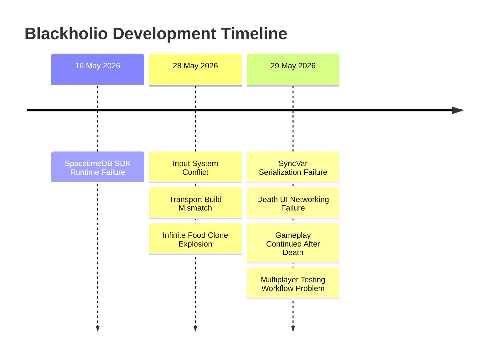

---

# 🧠 Architecture Evolution

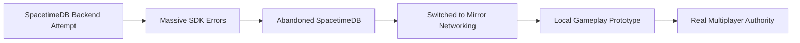

---

# 16 May 2026

# 🐛 Bug — SpacetimeDB SDK Runtime Failure 🔥😵

## Error

```txt
ITuple could not be found
System.Runtime.CompilerServices.ITuple
```

Also included:

```txt
CS0315
CS7069
Unable to resolve reference 'Microsoft.CodeAnalysis'
Unable to resolve reference 'System.Collections.Immutable'
```

---

## Failure Dependency Chain

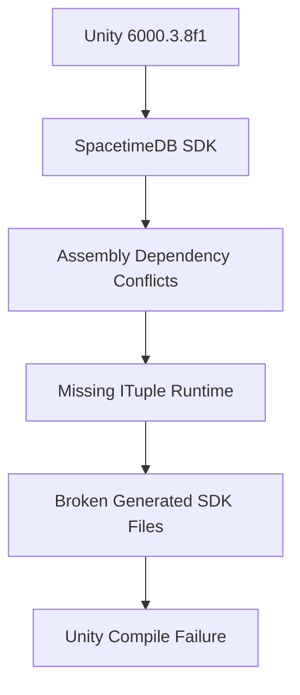

---

## Cause

* SpacetimeDB SDK dependency conflict.
* Runtime conflicts with Unity 6.
* SDK expected different .NET/runtime environment.
* Generated SDK files failed type resolution.

---

## Why This Was Difficult 😵

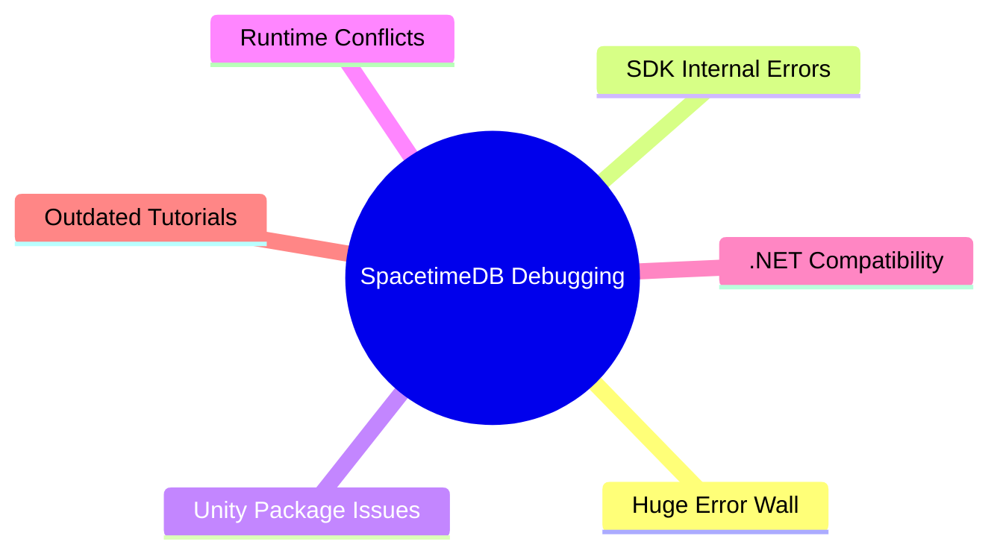

---

## Final Decision ✅

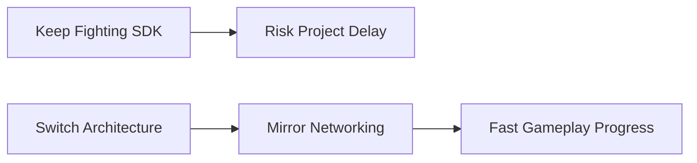

* Abandoned SpacetimeDB for MCA prototype.
* Switched to:

  * Mirror Networking
  * KcpTransport
  * Gameplay-first architecture

---

# 28 May 2026

# 🐛 Bug — Unity Input System Conflict ⚠️

## Error

```txt
InvalidOperationException:
You are trying to read Input using the UnityEngine.Input class,
but you have switched active Input handling to Input System package.
```

---

## Cause Diagram

```mermaid
flowchart TD
    A[Unity 6 Project] --> B[New Input System Enabled]
    C[Old Tutorial Code] --> D[Input.GetAxisRaw()]
    B --> E[Conflict]
    D --> E
```

---

## Fix ✅

```txt
Player Settings
→ Active Input Handling
→ Both
```

---

# 28 May 2026

# 🐛 Bug — Client Could Not Connect To Host 🌐

## Symptoms

* Host started correctly.
* Client clicked connect but nothing happened.

---

## Root Cause

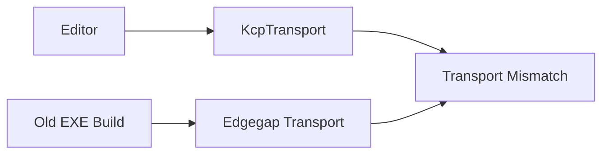

---

## Fix ✅

* Deleted old build folder.
* Rebuilt project completely.
* Reassigned:

```txt
NetworkManager → KcpTransport
```

---

# 28 May 2026

# 🐛 Bug — Infinite Food Clone Explosion 💥💀

## Symptoms

* Unity froze/crashed.
* Thousands of:

```txt
Food(Clone)
```

spawned instantly.

---

## Catastrophic Spawn Loop

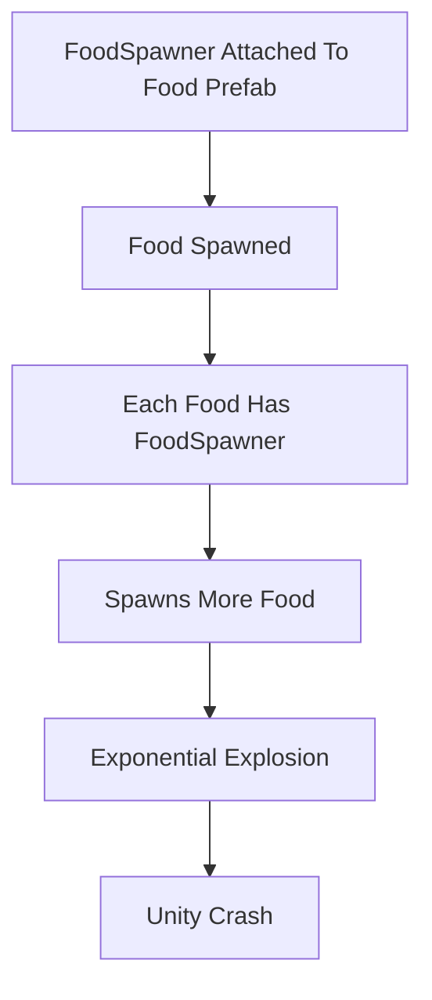

---

## Cause

🚨 `FoodSpawner.cs` accidentally attached to Food prefab.

---

## Fix ✅

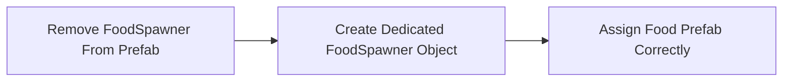

---

# 29 May 2026

# 🐛 Bug — Mirror SyncVar Serialization Failure ⚡

## Error

```txt
Type '[Assembly-CSharp]PlayerMovement'
has an extra field 'size'
```

---

## Serialization Breakdown

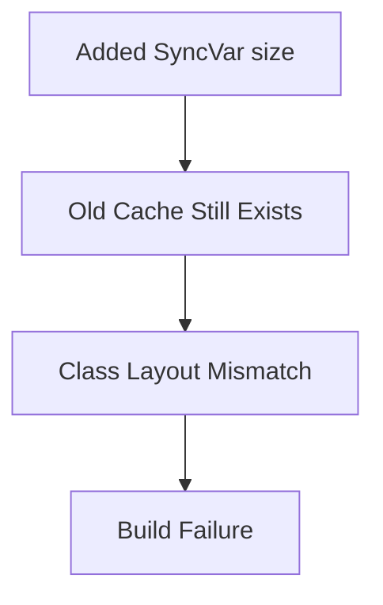

---

## Fix ✅

Deleted:

```txt
Library/
Temp/
Obj/
```

Then:

* reopened Unity
* rebuilt project

---

# 29 May 2026

# 🐛 Bug — Death UI Only Worked On Host 🧠🔥

## Symptoms

* Host could eat client.
* Host grew correctly.
* Client never saw death screen.

---

## Multiplayer Authority Confusion

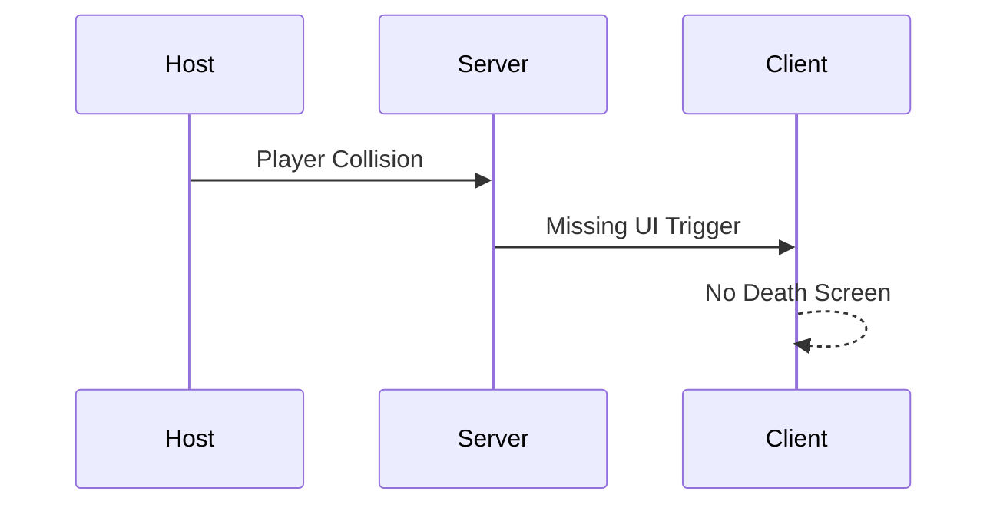

---

## Realization 💡

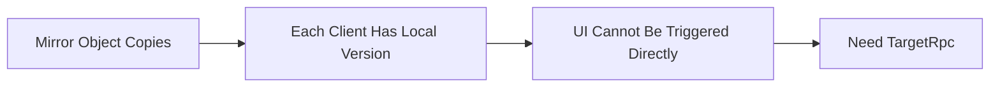

---

## Final Correct Networking Flow ✅

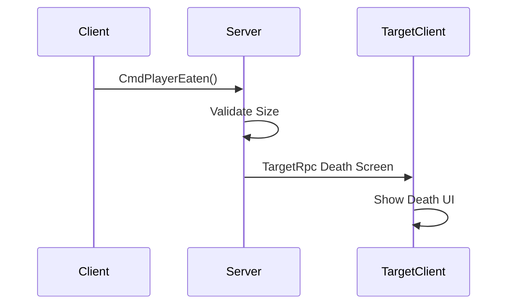

---

# 29 May 2026

# 🐛 Bug — Gameplay Continued After Death 👻

## Symptoms

* Death UI appeared.
* Dead player still:

  * moved
  * collided
  * existed in game

---

## Missing State Transition

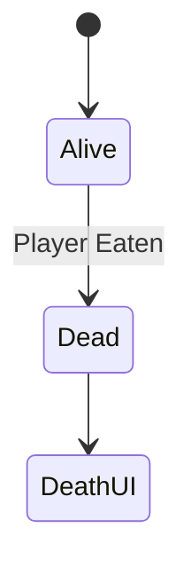

---

## Fix ✅

Added:

```csharp
[SyncVar]
bool isDead;
```

Then:

* disabled movement
* disabled collider
* hid sprite
* synchronized death state

---

# 29 May 2026

# 🐛 Bug — Multiplayer Testing Workflow Was Painful 😫

## Old Workflow

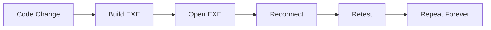

---

## Discovery 🚀

Unity 6 Multiplayer Play Mode:

```txt
Window
→ Play Mode
→ Scenarios
```

---

## New Workflow

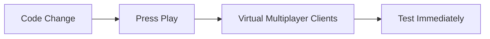

---

## Result ✅

Now able to rapidly test:

* RPCs
* SyncVars
* Authority
* Collisions
* Multiplayer gameplay

WITHOUT rebuilding constantly.

---

# 🏁 Current Project State

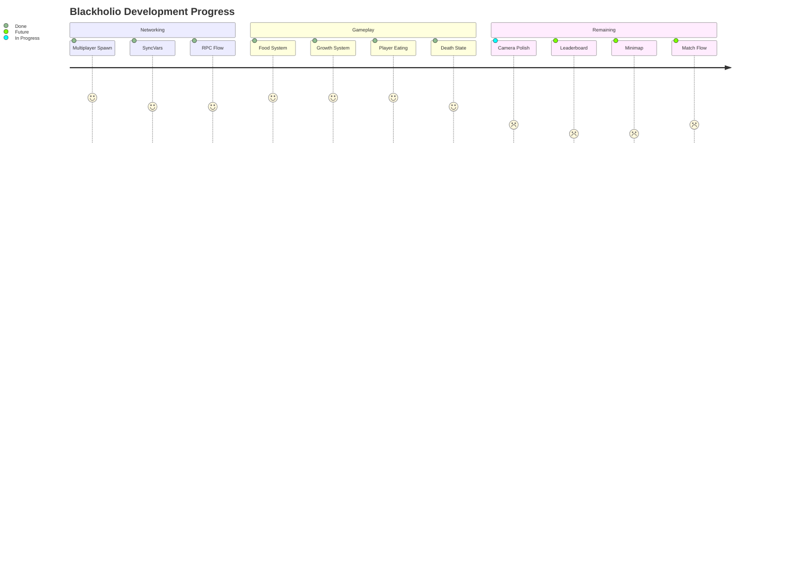
