````markdown
# Blackholio — Development Log

> Multiplayer agar.io-inspired game built in Unity using Mirror Networking.  
> This document tracks technical progress, networking architecture, debugging sessions, failed experiments, and gameplay milestones.

---

# 📈 Overall Development Progress

```mermaid
journey
    title Blackholio Development Journey

    section Foundation
      Unity Project Setup : 5: Done
      Mirror Networking Setup : 5: Done
      Multiplayer Spawn : 5: Done

    section Gameplay
      Food System : 5: Done
      Growth System : 5: Done
      Player Eating : 5: Done
      Death State : 4: Done

    section Tools
      Multiplayer Play Mode : 5: Done
      Debug Workflow : 4: Improved

    section Future
      Score UI : 2: Planned
      Leaderboard : 1: Planned
      Match Flow : 1: Planned
````

---

# Week 1 — Networking Foundation

## 📅 28 May 2026

# 🎯 Main Goal

Establish a stable multiplayer foundation before implementing gameplay systems.

---

# ✅ Project Initialization

## Completed

* Created fresh Unity 6000.3.8f1 project
* Selected Universal 2D template
* Planned agar.io-inspired multiplayer architecture
* Evaluated networking/backend options
* Decided to prioritize rapid gameplay iteration

---

# 🔄 Architecture Evolution

```mermaid
flowchart LR
    A[Original Plan]
    --> B[SpacetimeDB Backend]

    B --> C[SDK Runtime Errors]
    C --> D[Slow Development Speed]

    D --> E[Switched Architecture]

    E --> F[Mirror Networking]
    F --> G[KcpTransport]
    G --> H[Gameplay First Development]
```

---

# ❌ SpacetimeDB Experiment

## Attempted Stack

* Unity
* SpacetimeDB
* Reducers
* Tables
* C# SDK

---

## Major Problems Encountered

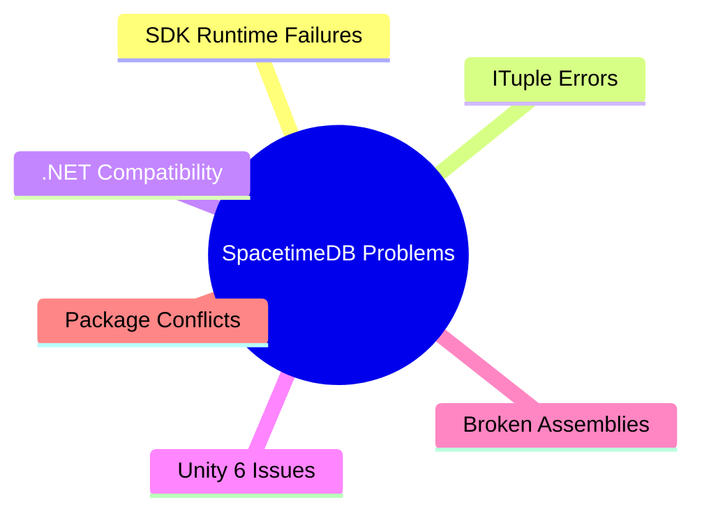

---

## Final Decision

Abandoned SpacetimeDB for current MCA prototype.

### Reason

The backend architecture complexity started slowing actual gameplay progress.

---

# ✅ New Multiplayer Stack

## Final Chosen Stack

* Unity 6
* Mirror Networking
* KcpTransport
* Multiplayer Play Mode
* (Supabase planned later for leaderboard/auth)

---

# Why Mirror Was Chosen

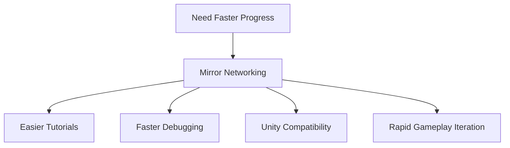

---

# 🌐 Multiplayer Setup

## Mirror Networking Installed

### Added Core Components

* NetworkManager
* KcpTransport
* NetworkManagerHUD

---

## Learned Concepts

Mirror handles:

* player spawning
* synchronization
* host/client networking
* SyncVars
* RPCs

Unlike SpacetimeDB:

* no reducers
* no database tables
* gameplay logic managed directly in Unity

---

# 🧠 Multiplayer Architecture Understanding

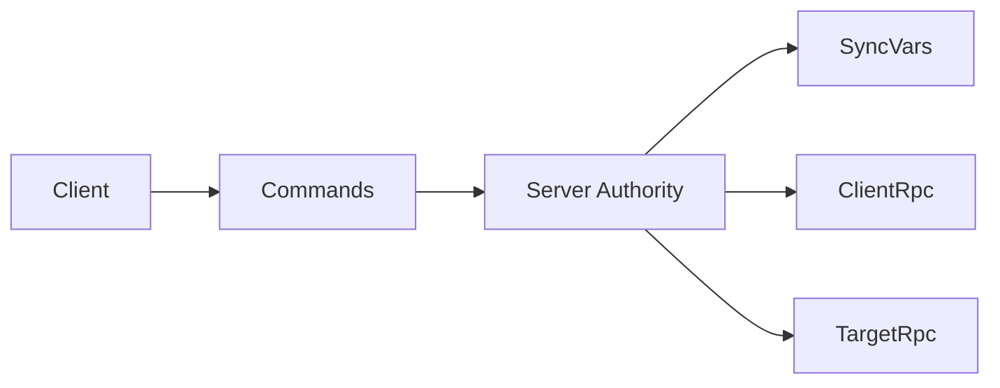

---

# 👤 Player Prefab Setup

## Player Object Created

### Components Added

* SpriteRenderer
* Rigidbody2D
* CircleCollider2D
* NetworkIdentity
* NetworkTransformReliable

---

## Physics Fix

### Problem

Player circle constantly fell downward.

### Cause

Rigidbody2D gravity enabled by default.

### Fix

```txt
Gravity Scale = 0
```

---

# 🎮 Multiplayer Movement System

## Implemented

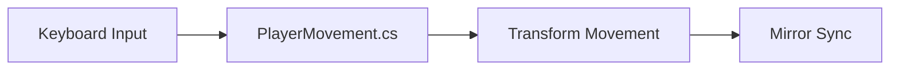

---

## Learned

```txt
isLocalPlayer
```

is critical in multiplayer.

Without it:

* all clients try controlling every player.

---

# ⚠️ Input System Conflict

## Error Encountered

```txt
InvalidOperationException:
Input.GetAxisRaw used while Input System package enabled
```

---

## Fix

```txt
Player Settings
→ Active Input Handling
→ Both
```

---

# 🧪 Multiplayer Testing Phase

## Initial Workflow 😫

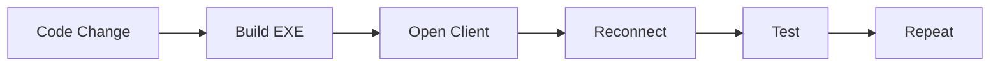

This became extremely slow during debugging.

---

# 🚀 Discovery — Multiplayer Play Mode

Unity 6 includes native multiplayer simulation.

## Setup

```txt
Window
→ Play Mode
→ Scenarios
```

Created:

```txt
Build test
```

scenario.

---

# New Workflow 🚀

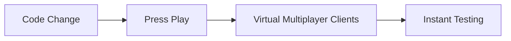

---

# 🍎 Food System

## Goal

Create agar.io-style growth mechanic.

---

## Implemented

* food prefab
* random food spawning
* collision detection
* player growth

---

# 💥 Critical Bug — Infinite Clone Explosion

## Problem

Unity froze due to:

```txt
Food(Clone)
Food(Clone)
Food(Clone)
...
```

---

## Root Cause

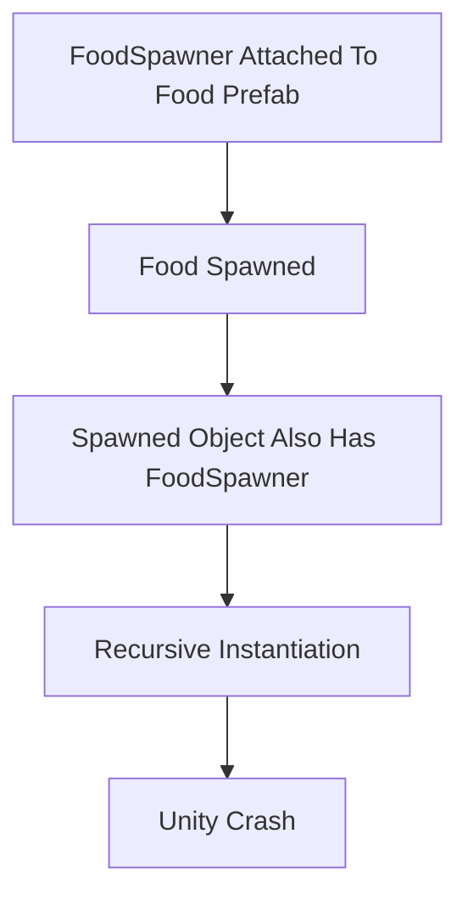

---

## Fix

Created dedicated:

```txt
FoodSpawner GameObject
```

---

# 📏 Growth System

## Added

```csharp
[SyncVar]
public float size = 1f;
```

---

## Result

Player size now synchronizes correctly across clients.

---

# ⚠️ Serialization Problem

## Error

```txt
script class layout is incompatible
```

---

## Cause

SyncVar changes invalidated cached serialization layout.

---

## Fix

Deleted:

```txt
Library/
Temp/
Obj/
```

Then rebuilt project.

---

# ⚔️ Player Eating Mechanic

## Goal

Bigger player can consume smaller player.

---

# Initial Incorrect Approach ❌

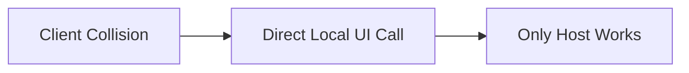

---

# Networking Realization 💡

Each client owns separate local object copies.

UI cannot be directly triggered from another machine.

---

# Final Correct Architecture ✅

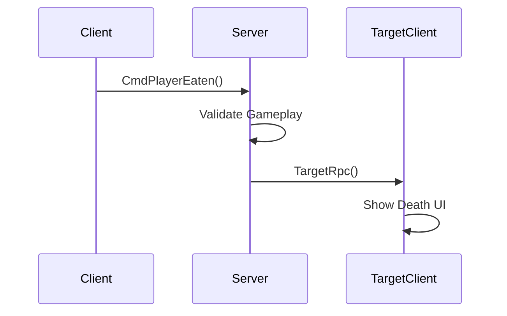

---

# ☠️ Death System

## Implemented

* death UI
* dead state
* collision disabling
* sprite hiding
* synced death state

---

# Death State Flow

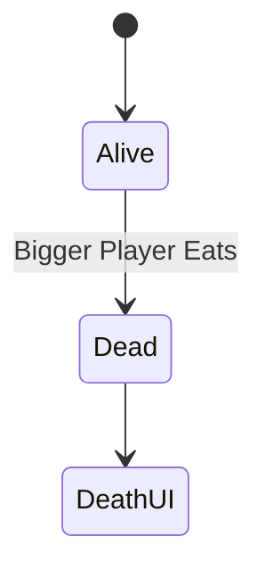

---

# 🎥 Camera Follow System

## Implemented

Local camera follows only:

```txt
isLocalPlayer
```

---

# Result

Each multiplayer instance now has:

* independent camera
* proper local perspective
* improved gameplay feel

---

# 🧠 Biggest Lessons Learned So Far

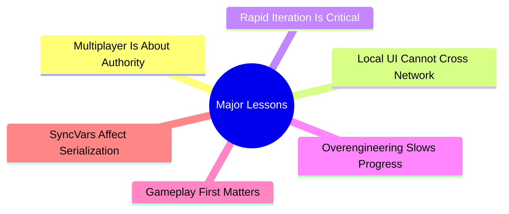

---

# 🏁 Current Playable Features

## Multiplayer Gameplay Loop

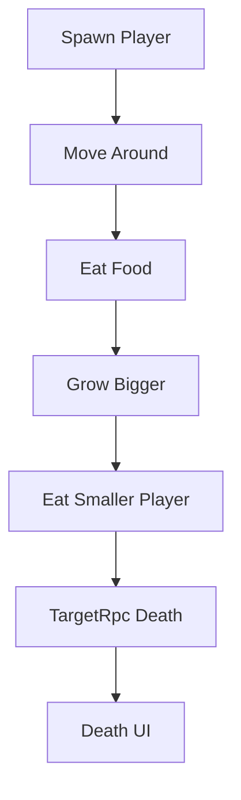

---

# 📌 Current Project Status

## Working Systems

* Multiplayer spawn
* Synced movement
* Food spawning
* Food eating
* Size synchronization
* Player eating
* Death handling
* Multiplayer testing workflow
* Camera follow

---

# 🔮 Planned Features

## Next Features

* map boundaries
* speed scaling by size
* score UI
* food respawn balancing
* leaderboard
* minimap
* match flow
* Supabase integration

