# Blackholio — Feature Roadmap

> Multiplayer agar.io-inspired game built in Unity using Mirror Networking.  
> This document tracks implemented systems, planned gameplay mechanics, networking architecture, UI systems, and future improvements.

---

# 🎮 Current Game Overview

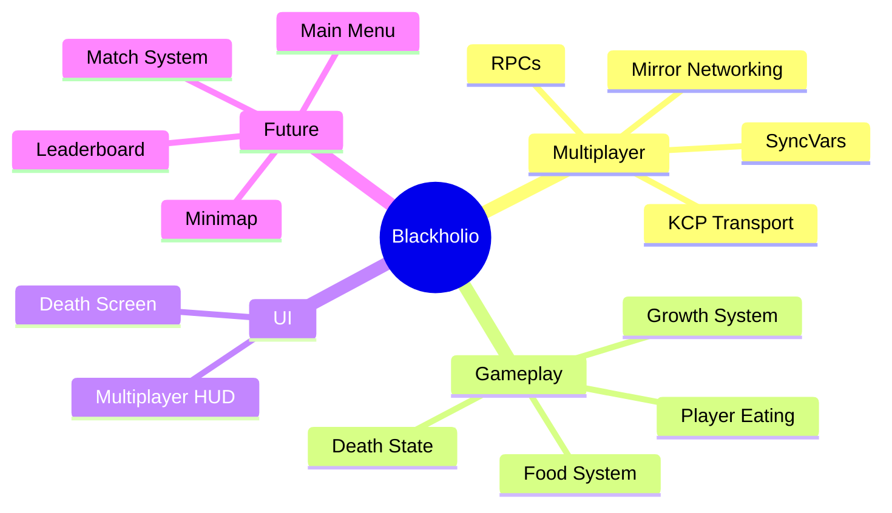

---

# 📊 Overall Feature Progress

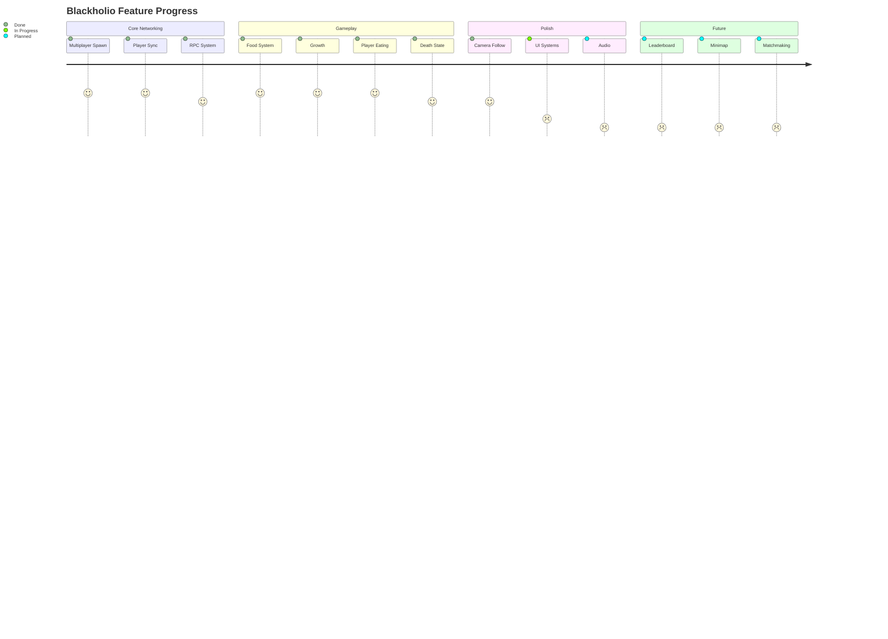

---

# ✅ COMPLETED FEATURES

## 🌐 Multiplayer Foundation
* **Status:** Implemented

### Features
* Host/client multiplayer architecture
* Player spawning handling
* Local player authority isolation
* Synced transform movement
* Optimized multiplayer testing workflow
* KCP transport protocol layer setup

### Networking Architecture
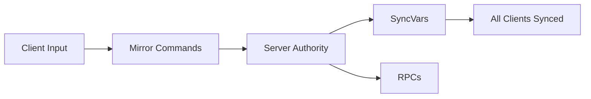

---

## 👤 Player System
* **Status:** Implemented

### Features
* Circle player movement handling
* Rigidbody2D physics configuration
* Local player isolated control loops
* Multiplayer network transform synchronization
* Independent camera rigs per client

### Player Lifecycle
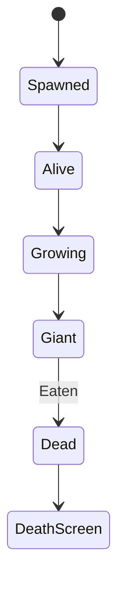

---

## 🍎 Food System
* **Status:** Implemented

### Features
* Instantiated food prefabs
* Random coordinate world spawning
* 2D trigger collision detection
* Scale growth calculations on consumption

### Food Gameplay Loop
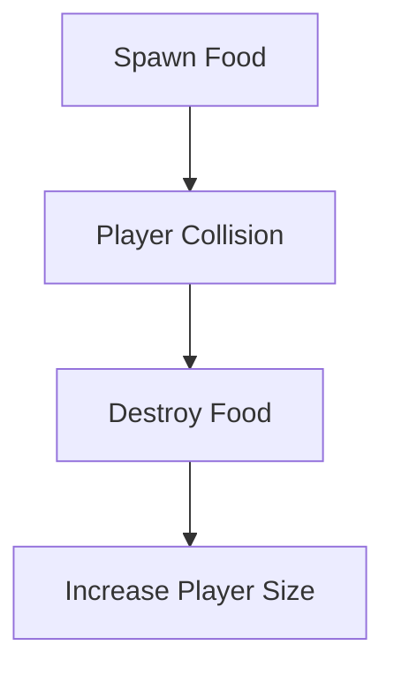

---

## 📏 Growth System
* **Status:** Implemented

### Features
* `[SyncVar]` engine size synchronization
* Real-time local mesh scale updates
* Multiplayer-visible scaling loops
* Globally shared growth state tracking

### Growth Sync Flow
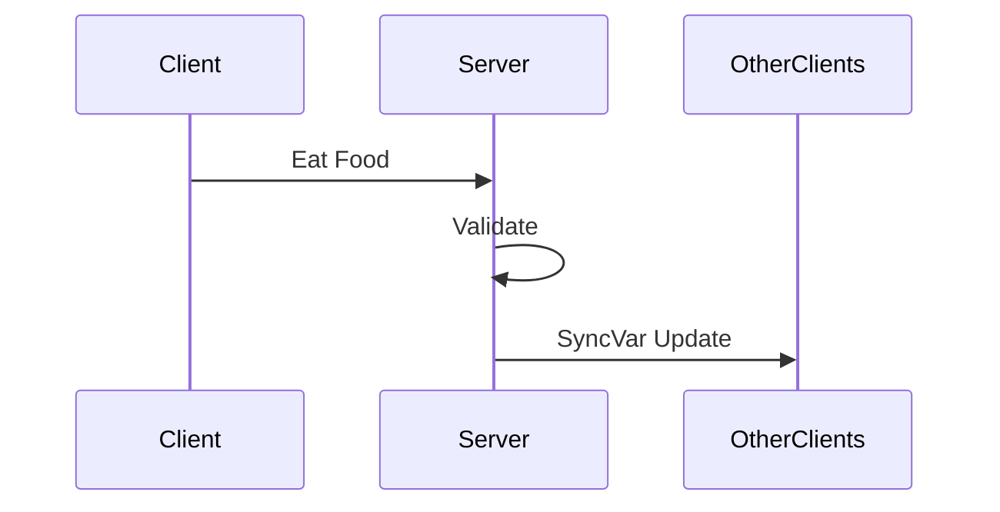

---

## ⚔️ Player Eating System
* **Status:** Implemented

### Features
* Scale checks allowing bigger players to consume smaller ones
* Strict server-side collision validation
* Multiplayer-safe network authority flows
* Smooth scale transfer processing on successful consumption

### Eat Mechanic
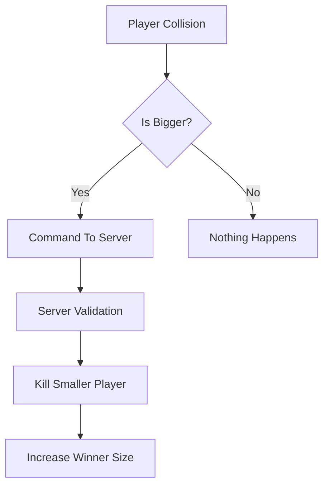

---

## ☠️ Death System
* **Status:** Implemented

### Features
* Fully synchronized death logic states
* Dedicated TargetRpc Death Screen UI panels
* Automatic movement script disabling post-death
* Invisible visual state toggles for dead players
* Dynamic physics collider state disabling

### Death Flow
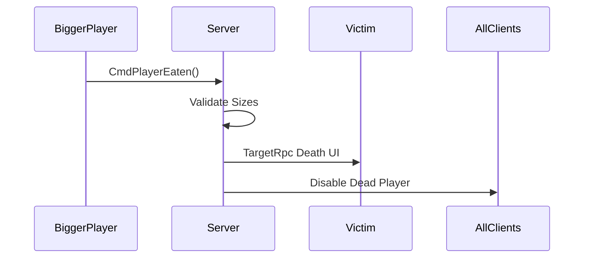

---

## 🎥 Camera Follow System
* **Status:** Implemented

### Features
* Isolated local player camera tracking loops
* Multiplayer-safe network camera targeting passes
* Completely independent viewport rendering per client

### Camera Logic
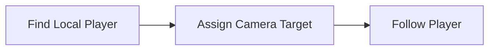

---

## 🧪 Multiplayer Testing Workflow
* **Status:** Implemented

### Features
* Unity 6 native Multiplayer Play Mode configurations
* Concurrent virtual background client runtimes
* Fast intra-editor design iteration workflows
* Complete removal of slow executable project rebuilding phases

### Testing Workflow Evolution
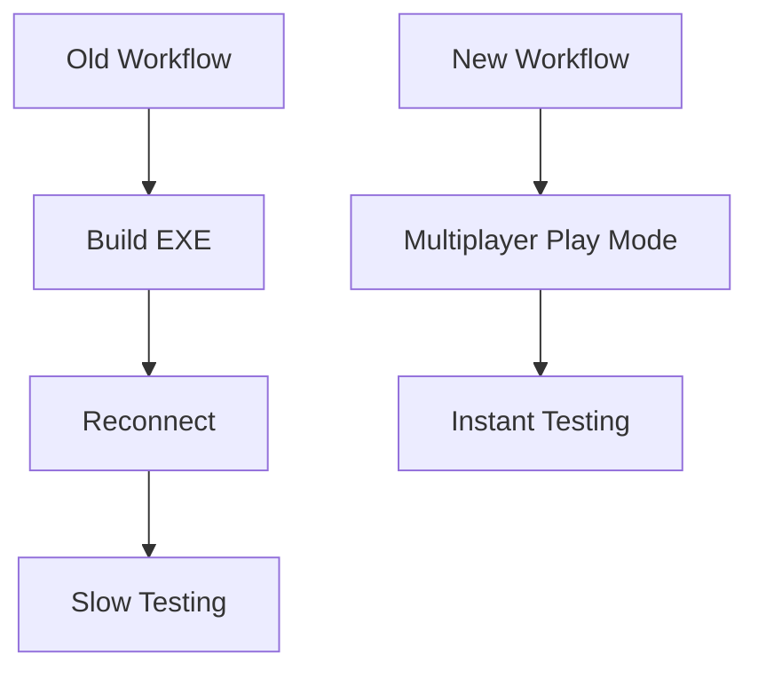

---

# 🚧 CURRENTLY IN PROGRESS

## 🗺️ Map Boundary System
* **Status:** In Progress

### Planned Features
* Prevent infinite runtime world movement drift
* Systematically force active cluster player interaction
* Locked containment arena bounds walls

### Planned Logic
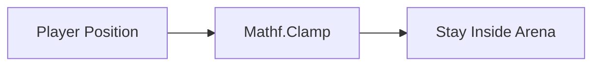

---

## ⚖️ Size-Based Speed System
* **Status:** In Progress

### Goal
Balance core pacing dynamically by mapping scale thresholds:
* Smaller players retain high speed profiles
* Massive players suffer scalar speed reductions

### Planned Formula
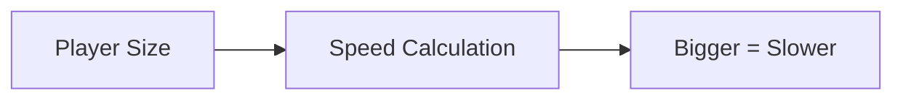

---

# 📋 PLANNED FEATURES

## 🏆 Leaderboard System
* **Status:** Planned

### Planned Features
* Active top player stack ui rendering
* High-frequency real-time rank sorting
* Multi-client network score synchronization passes

### Planned Stack
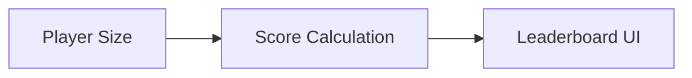

---

## 🧭 Minimap System
* **Status:** Planned
* **Planned Features:** World map scale indicators, player positioning dots, perimeter boundary alerts.

## 🍎 Food Respawn System
* **Status:** Planned
* **Goal:** Dynamic respawn processing loops maintaining optimized grid food density levels.
* **Logic flow:**
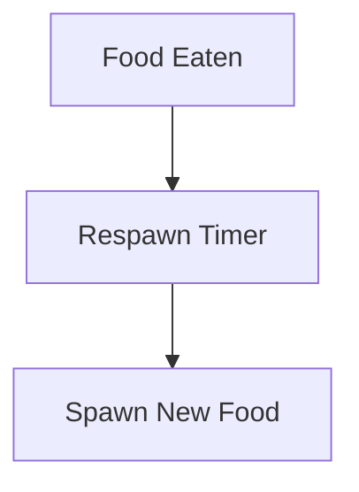

## 🎵 Audio System
* **Status:** Planned
* **Planned Features:** Consumption audio cues, clean death impacts, ui click events, atmospheric backing music tracking.

## 🧾 Score UI
* **Status:** Planned
* **Planned Features:** Dedicated scale tracking modules, current mass counters, optimized update tracking loops.

## 🏠 Main Menu System
* **Status:** Planned
* **Planned Features:** Dedicated starter scenes, network matchmaking profiles, engine application exit routing.

## 🔐 Authentication + Backend
* **Status:** Planned
* **Planned Stack:** Supabase integration, profile database tables, global cloud database records, post-match statistical arrays.

### Planned Architecture
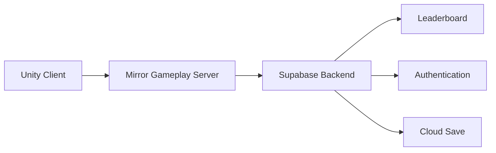

---

# 🧠 Technical Lessons Learned

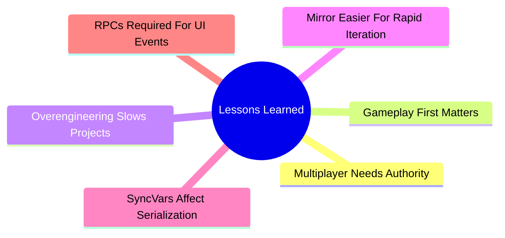

---

# 🏁 CURRENT PLAYABLE LOOP

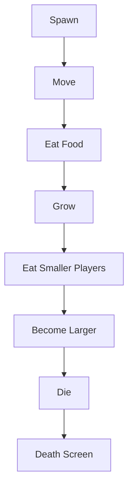

---

# 📌 Current State Summary

### Core Systems Working
* ✅ Multiplayer network player spawning  
* ✅ Synced transform network movement  
* ✅ Dynamic network food spawning  
* ✅ Active food consumption tracking  
* ✅ Accurate growth scale synchronization  
* ✅ Dynamic relative player eating rules  
* ✅ Isolated client death sequence cycles  
* ✅ Local TargetRpc Death UI panels  
* ✅ Unity 6 Multi-process Editor workflows  
* ✅ Isolated local player camera tracking  

---

# 🚀 Long-Term Vision

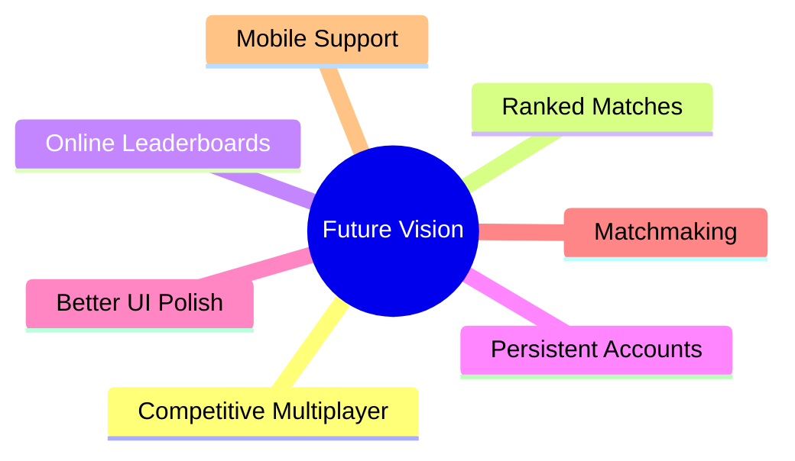
